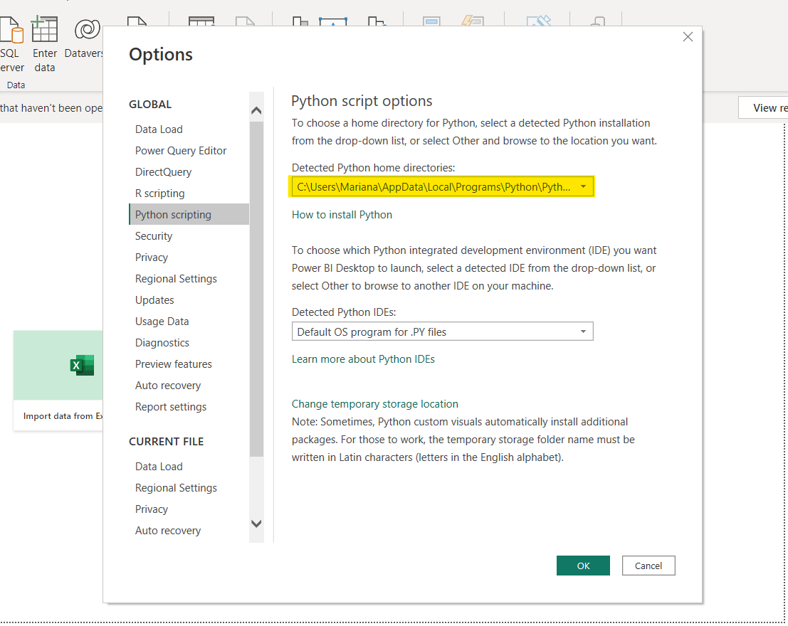
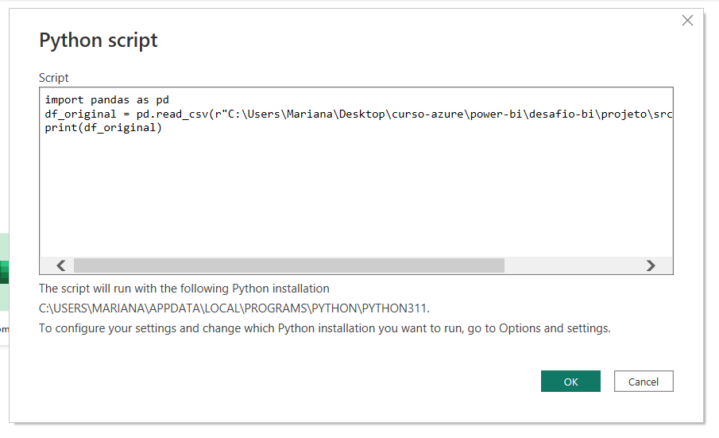
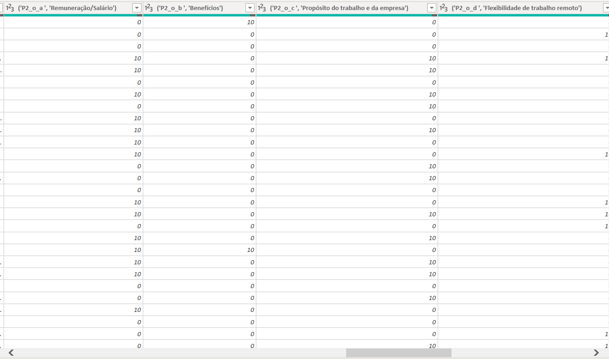
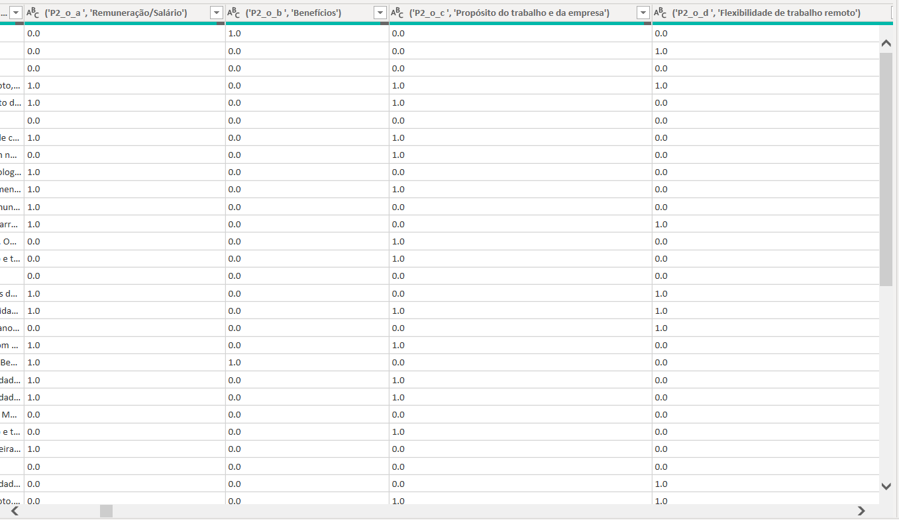
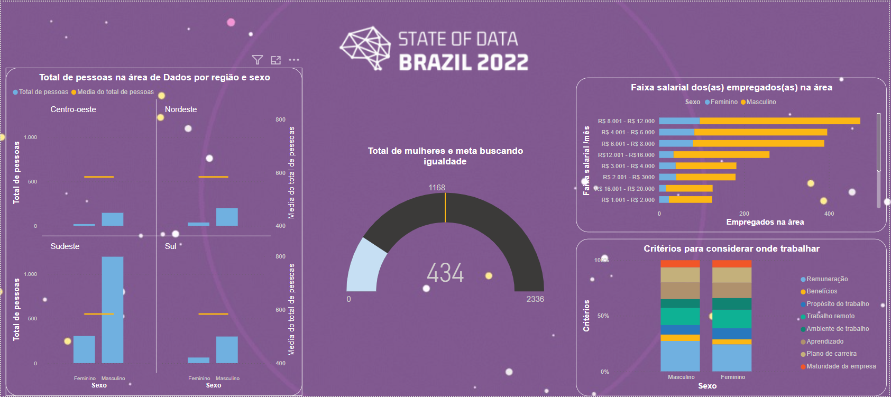
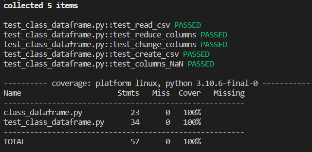

# Python script on Power BI

This project proposed by 'Academia Mulheres in Tech Data Engineer- Azure' aims to create Python scripts for reading CSV files and integrating them with PBI (Power BI).
The dataset used corresponds to 21 columns extracted from the <a href="https://www.kaggle.com/datasets/datahackers/state-of-data-2021">'State of Data Brasil 2021'</a> dataset.

## Getting Started

These instructions will get you a copy of the project up and running on your local machine for development and testing purposes. 

### Prerequisites

The version of Python used in this project is 3.10.
To run the main.py file, You'll need to install the libs:

* pandas
* dotenv

Install them using the package manager 'pip':

```
pip install pandas
```

```
pip install python-dotenv
```
### Quick code explanation

The code structure was developed as follow:

```
src
├── libs
│   ├── csv
│   ├── test_class_dataframe.py
│   ├── class_dataframe.py
├── main.py
└── script.py
```
* main.py: That's the code you should run in order to generate a CSV file without any column type errors. Make sure to set it with the correct columns to downsize and/or change the column types. 
* script.py: That's the code you should run on Power BI.

### Run Python on Power BI

To run a python script on Power BI, you'll need to set the path of your Python as shown below.



Then in 'Get Data' choose 'Python Script' and copy/paste the script.py content:



Now you're read to Load the date and create your PBI dashboard.



If you're curious to see if the changing type method works, repeat the process and open the original dataset instead.



As you can see, some numeric columns were indentified by Power BI as text columns. Therefore, the changing that was shown before worked.

### Dashboard

Now you can create a Power BI dashboard to explore and analise the data.



## Unit tests

This project was focused on writing happy paths for unit testing. 
Since it's a simple project with only one unit, a Dataframe class, only one test file was created.
The development of more functionalities and classes in the future is expected, and therefore their unit testing as well.
If you wish to add a new functionality and create a unit test for it, you can follow these steps to run your tests:

### Installing Pytest

To run the tests, you'll need to install:

```
pip install pytest
```

### Running the tests

On the file test directory, run:

```
pytest -vv --cov=. --cov-report=term-missing {name_of_the_test_file.py}
```
pip install pytest-cov

This will tell you if your test passes ou fails, as well as the coverage area.
For this project, the actual coverage area is shown below.



## License
This project is licensed under the MIT License - see the LICENSE.md file for details

